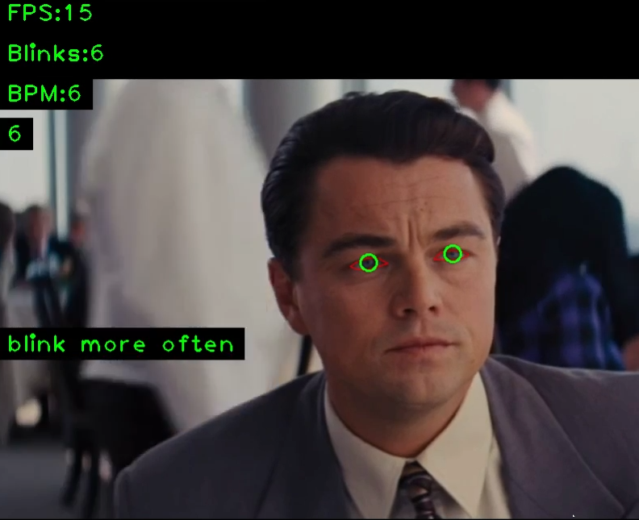

# Blink detect and count
App detects blinking with OpenCV and MediaPipe. 
It counts blinks, show BPM(blinks per minute) and play sound alarm if you rarely blink.

## Demo

[Video demo 1](https://youtu.be/5dD0g7gLdYk)

[Video demo 2 with alarm sound](https://youtu.be/HSQjUue9AMc)
